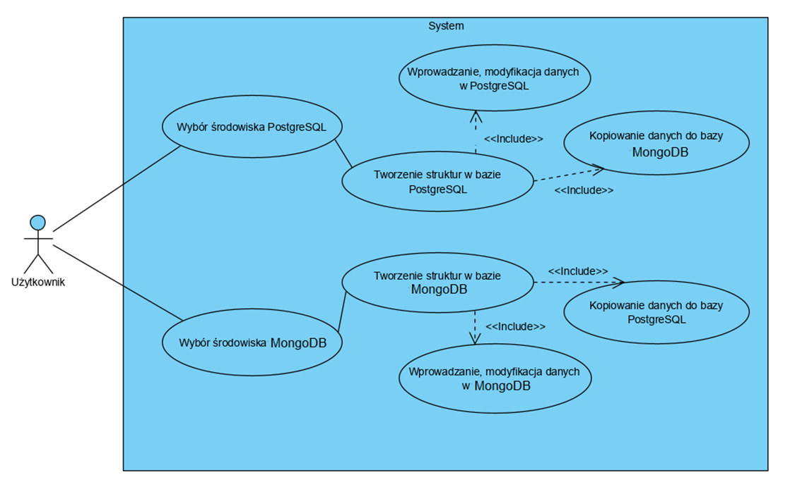
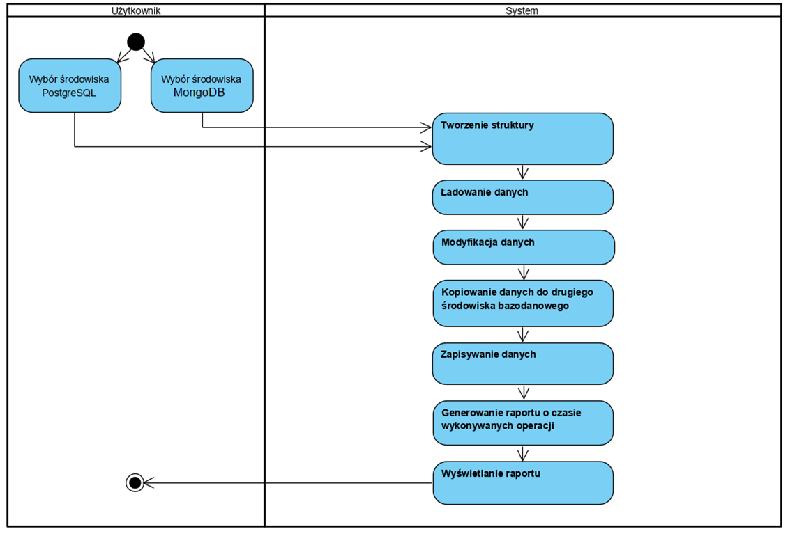
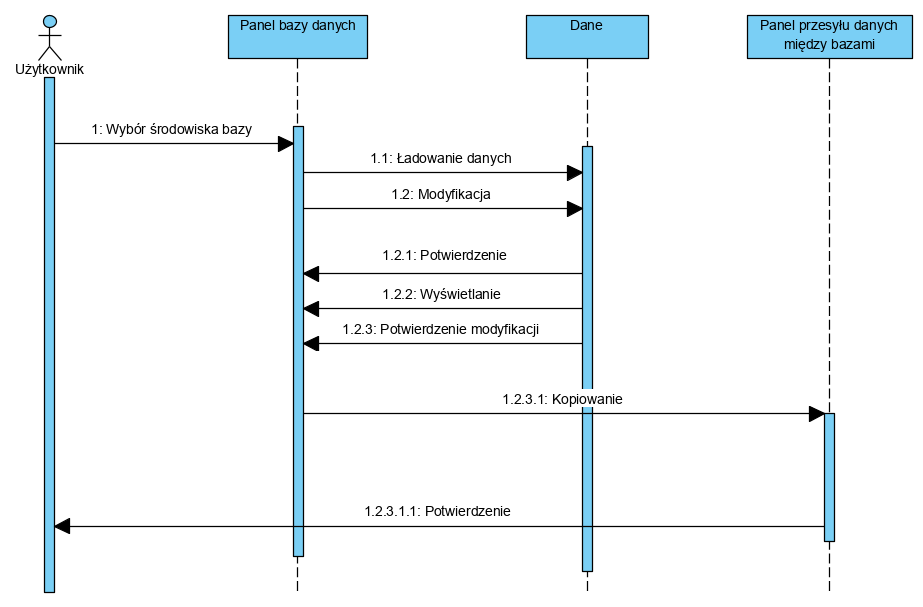

# AplikacjaBazodanowa2019

# System ułatwiający współdziałanie dwóch różnych silników bazodanowych – PostgreSQL oraz Mongodb.

### Spis treści:
  1.	Cel i funkcje systemu
  2.	Dane gromadzone przez system
  3.	Autorzy aplikacji
  4.	Terminarz
  5.	Podział prac między członków zespołu
  6.	Schematy UML.
  

### 1. Cel i funkcje systemu:
System ma spełniać podstawowe założenia jako menadżer plików dla  dwóch różnych środowisk bazodanowych – PostgreSQL oraz Mongodb. 
- Aplikacja ta, będzie umożliwiać użytkownikowi m.in. CRUD (tworzenie / dodawanie, odczytywanie / wyświetlanie, aktualizowanie, usuwanie) oraz export danych z jednej bazy do drugiej. 
- Użytkownik będzie mógł poznać czas wykonywania operacji import,export.

### 2.	Dane gromadzone przez system:
Obie bazy będą posiadać takie same dane i struktury, ponieważ aplikacja ma za główne zadanie sprawne kopiowanie plików ze środowiska PostgreSQL do Mongodb. 
System bedzie zapisywał czasy poszczególnych operacji, w celu porównawczym. Na podstawie tego, generowany będzie raport wyświetlający czasy operacji.

### 3.	Autorzy aplikacji:
  - Jednacz Bartosz
  -	Nędza Patrycja
  -	Wojdyła Marek
  
  
  
  
### 4.	Termiarz pracy:
  -	Opracowanie założeń i wymagań: *28.10.2019*
  -	Opracowanie wstępnej dokumentacji: *04.11.2019*
  -	Implementacja: *25.11.2019*
  -	Testy: *02.11.2019*
  -	Przygotowanie całkowitej dokumentacji: *09.12.2019*
  -	Prezentacja projektu, rozliczenie, zaliczenie: *16.12.2019*
  
  
  
  
### 5. Podział prac między członków zespołu:
  -	Marek Wojdyła:
    - programowanie back-endu aplikacji w języku PHP.
    - baza danych MongoDB

  -	Nędza Patrycja:
    - dokumentacja aplikacji
    - kopiowanie danych między bazami

  -	Bartosz Jednacz:
    - programowanie front-endu aplikacji w języku PHP.
    - baza danych PostgreSQL

### 6. Schematy UML:
  -	Diagram użycia: 
  
  
  
  
  
  
  -	Diagram aktywności:
  
  
  
  
  
  
  -	Diagram sekwencji:
  
  
  
  
  
